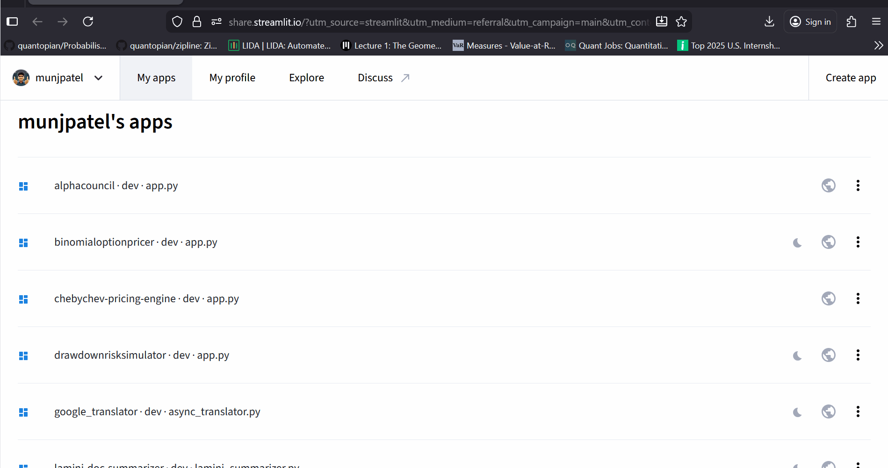

📊 Chebyshev Pricing Engine

A non-parametric volatility model for detecting "Black Swan" anomalies in asset prices.



🚀 Overview

Standard financial models (like Bollinger Bands) assume asset returns follow a Normal (Gaussian) distribution. However, real markets exhibit "fat tails" and extreme skewness.

The Chebyshev Pricing Engine utilizes Chebyshev’s Inequality to construct probability bounds that hold true for any probability distribution, provided the variance is finite. This makes it a robust tool for identifying extreme market regimes and outliers ($k=10$) that traditional models miss.

🧮 The Mathematics

The engine calculates bounds based on the inequality:

$$P(|X - \mu| \ge k\sigma) \le \frac{1}{k^2}$$

Where:

We transform prices to Log-Space: $L = \ln(P)$ to approximate symmetry.

The Upper and Lower bounds are derived as:


$$\text{Bound} = e^{\mu_L \pm k\sigma_L}$$

KL Divergence is calculated dynamically to measure the drift between the Forecast Distribution and Actual Price Distribution.

⚡ Key Features

Regime Detection: Automatically classifies market state (Stable, Oversold, Overbought) based on $k$-bound breaches.

Multi-Asset Universe: Pre-loaded with ~100 tickers across Tech, Crypto, and Indices.

Visual Analytics: Interactive Plotly charts for Time Series and Kernel Density Estimation (KDE).

Breach Reporting: Generates downloadable CSV reports of all statistical anomalies.

🛠️ Tech Stack

Frontend: Streamlit

Math/Stats: SciPy (Entropy, KDE), NumPy

Data: yFinance (Real-time ingestion)

Visualization: Plotly Graph Objects

📦 Installation
```
git clone [https://github.com/yourusername/Chebyshev-Pricing-Engine.git](https://github.com/yourusername/Chebyshev-Pricing-Engine.git)
cd Chebyshev-Pricing-Engine
pip install -r requirements.txt
streamlit run app.py
```
